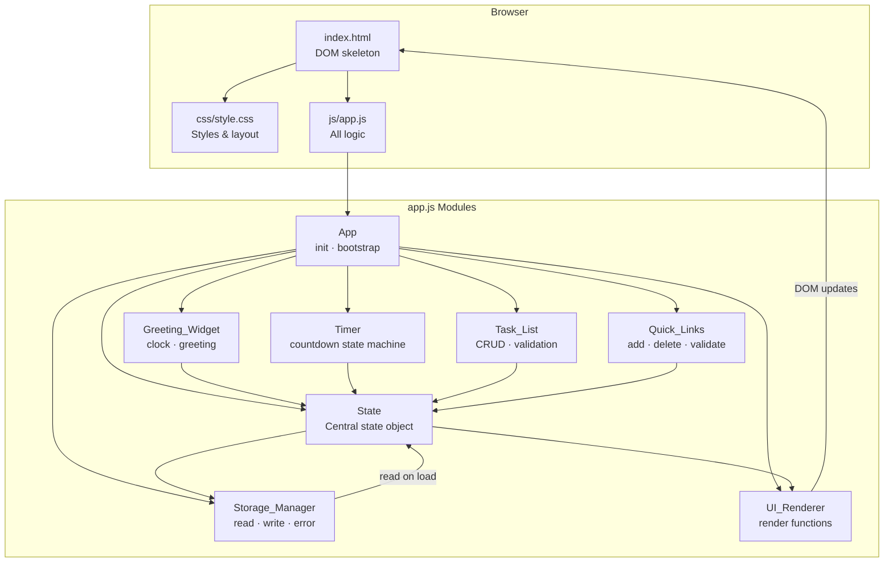

# Design Document

## Overview

The To-Do List Life Dashboard is a zero-dependency, client-side single-page application (SPA) that runs entirely in the browser. It is structured as three static files — `index.html`, `css/style.css`, and `js/app.js` — with no build step, no transpilation, and no network requests beyond the initial file load.

All application state lives in a plain JavaScript object inside `app.js`. The `Storage_Manager` module syncs that state to `localStorage` after every mutation. On first load, `Storage_Manager` reads persisted data back into the state object, and the `UI_Renderer` builds the DOM from scratch. All subsequent DOM updates are triggered by user events and handled through a central render cycle.

The four visible widgets — `Greeting_Widget`, `Timer`, `Task_List`, and `Quick_Links` — share no direct coupling. Each widget has its own module object inside `app.js` responsible for its own state transitions, event handling, and render calls. A top-level `App.init()` function bootstraps everything on `DOMContentLoaded`.

---

## Architecture

### Component Diagram



### Data Flow

```
User Event
    │
    ▼
Widget Event Handler  (e.g. Tasks.add, Timer.start)
    │
    ▼
State Mutation        (mutate App.state)
    │
    ├──► Storage_Manager.save()   (synchronous localStorage write)
    │
    └──► UI_Renderer.render*()    (targeted DOM update)
```

---

## Components and Interfaces

### App (top-level namespace)

The single global object exported by `app.js`. Everything else is a property of this object, avoiding global namespace pollution.

```js
const App = (function () {

  const state = { /* see Data Models */ };

  return {
    state,
    init()         // DOMContentLoaded entry point
  };
})();
```

`App.init()` is the only function called from the global scope. It:
1. Calls `Storage_Manager.load()` to hydrate `App.state`.
2. Calls each widget's `init()` to attach event listeners.
3. Calls `UI_Renderer.renderAll()` for the initial paint.
4. Starts the `Greeting_Widget` and `Timer` clock intervals.

---

### Storage_Manager

Responsible for all `localStorage` I/O. It never touches the DOM.

| Function | Signature | Description |
|---|---|---|
| `load()` | `() → void` | Reads both keys; populates `App.state.tasks` and `App.state.links`; sets `App.state.storageAvailable`. |
| `saveTasks()` | `() → void` | Serialises `App.state.tasks` to JSON, writes to `"todo_life_dashboard_tasks"`. |
| `saveLinks()` | `() → void` | Serialises `App.state.links` to JSON, writes to `"todo_life_dashboard_links"`. |

Error handling contract:
- Any `localStorage` access is wrapped in a `try/catch`.
- On `SecurityError` / quota error during write, `App.state.storageAvailable` is set to `false` and `UI_Renderer.renderStorageBanner()` is called.
- On corrupt JSON during read, the collection is initialised to `[]` and `App.state.storageError` is set to `true`.

---

### UI_Renderer

Pure DOM-manipulation functions. They read from `App.state` and update specific DOM nodes. They never mutate state.

| Function | Updates |
|---|---|
| `renderAll()` | Calls all render functions below. |
| `renderGreeting()` | `#greeting`, `#time`, `#date` |
| `renderTimer()` | `#timer-display`, button disabled states |
| `renderTasks()` | `#task-list` (full re-render of `<ul>`) |
| `renderLinks()` | `#link-list` (full re-render of link buttons) |
| `renderStorageBanner()` | `#storage-banner` (shows/hides warning) |

The render approach for `Task_List` and `Quick_Links` is a **full list re-render** on every mutation. Given the small data size (max 20 links, practical task counts), this is simpler than diffing and has negligible performance cost in any target browser.

---

### Greeting_Widget

Stateless — reads only the system clock, derives display values, calls `UI_Renderer.renderGreeting()`.

| Function | Description |
|---|---|
| `init()` | Calls `tick()` immediately; sets `setInterval(tick, 60000)`. |
| `tick()` | Gets `new Date()`, derives time string, date string, greeting; calls renderer. |
| `getGreeting(hours)` | Pure function. Maps hour (0–23) → greeting string. |
| `formatTime(date)` | Pure function. Returns `"HH:MM"` string from a `Date` object. |
| `formatDate(date)` | Pure function. Returns `"Weekday, Month Day, Year"` string. |

Fallback: if `new Date()` returns an invalid date (`isNaN(date.getTime())`), `tick()` sets all fields to the fallback message `"Time unavailable"`.

---

### Timer

Implements a four-state machine.

```
         start()          tick (0 reached)
  IDLE ──────────► RUNNING ──────────────► DONE
   ▲   ◄──────────         ◄──────────────
   │     stop()              reset()
   │
   └──────────────────────────────── reset() from any state
```

| State | `start` btn | `stop` btn |
|---|---|---|
| `IDLE` | enabled | disabled |
| `RUNNING` | disabled | enabled |
| `DONE` | enabled | disabled |

| Property | Type | Description |
|---|---|---|
| `state.timerStatus` | `"idle" \| "running" \| "done"` | Current machine state |
| `state.timerRemaining` | `number` | Seconds remaining (0–1500) |
| `state.timerIntervalId` | `number \| null` | `setInterval` handle |

| Function | Description |
|---|---|
| `init()` | Attaches click listeners to Start, Stop, Reset buttons. |
| `start()` | Guards against duplicate start. Sets status to `"running"`, stores `setInterval(tick, 1000)` handle. |
| `stop()` | Calls `clearInterval`; sets status to `"idle"`. |
| `reset()` | Calls `clearInterval`; sets `timerRemaining = 1500`, status to `"idle"`; renders. |
| `tick()` | Decrements `timerRemaining`; renders; if `=== 0`, calls `done()`. |
| `done()` | Calls `clearInterval`; sets status to `"done"`; renders; shows notification; optionally calls `alert()`. |

The `start()` function checks `state.timerStatus === "running"` before creating a new interval — satisfying Requirement 2.10 (no duplicate intervals).

---

### Task_List

| Property | Type | Description |
|---|---|---|
| `state.tasks` | `Task[]` | The ordered task collection |
| `state.editingTaskId` | `string \| null` | ID of the task currently in inline edit mode |

| Function | Description |
|---|---|
| `init()` | Attaches delegated event listener to `#task-list` container and `#add-task-form`. |
| `add(description)` | Validates non-empty/non-whitespace; creates `Task`; pushes to `state.tasks`; saves; renders. |
| `startEdit(id)` | Sets `state.editingTaskId = id`; renders (shows inline input). |
| `confirmEdit(id, newDescription)` | Validates length ≤ 500 and non-whitespace; updates task; clears `editingTaskId`; saves; renders. |
| `cancelEdit()` | Clears `editingTaskId`; renders. |
| `toggleComplete(id)` | Flips `task.completed`; saves; renders. |
| `deleteTask(id)` | Filters out task by id; saves; renders. |
| `generateId()` | Returns `String(Date.now())` — sufficient for client-side uniqueness. |

**Delegated event handling**: a single `click` and `change` listener on the `#task-list` container reads `data-action` and `data-id` attributes from event targets, routing to the correct handler function. This avoids re-attaching listeners on every render.

---

### Quick_Links

| Property | Type | Description |
|---|---|---|
| `state.links` | `Link[]` | The ordered link collection |

| Function | Description |
|---|---|
| `init()` | Attaches listener to `#add-link-form` and delegated listener on `#link-list`. |
| `add(label, url)` | Validates all constraints (see below); creates `Link`; pushes to `state.links`; saves; renders. |
| `deleteLink(id)` | Filters out link by id; saves; renders. |
| `validateUrl(url)` | Returns `true` if `url` starts with `"http://"` or `"https://"`. |

**Validation matrix:**

| Field | Rule | Error message |
|---|---|---|
| `label` | Must be non-empty | "Label is required." |
| `url` | Must be non-empty | "URL is required." |
| `url` | Must start with `http://` or `https://` | "URL must start with http:// or https://" |
| `label` | Length ≤ 50 characters | "Label must be 50 characters or fewer." |
| `url` | Length ≤ 2000 characters | "URL must be 2000 characters or fewer." |
| Collection | Length < 20 | "Maximum of 20 links reached." |

Validation errors are written to `#link-form-error` as inline messages. On successful add, the error element is cleared and form fields are reset.

---

## Data Models

### Task

```js
/**
 * @typedef {Object} Task
 * @property {string}  id          - Unique identifier (String(Date.now()))
 * @property {string}  description - Task text, 1–500 characters
 * @property {boolean} completed   - Completion state; false on creation
 */
```

Example:
```json
{
  "id": "1728134400000",
  "description": "Finish design document",
  "completed": false
}
```

### Link

```js
/**
 * @typedef {Object} Link
 * @property {string} id    - Unique identifier (String(Date.now()))
 * @property {string} label - Display text, 1–50 characters
 * @property {string} url   - Full URL, must begin with http:// or https://, max 2000 chars
 */
```

Example:
```json
{
  "id": "1728134401234",
  "label": "GitHub",
  "url": "https://github.com"
}
```

### App State Object

```js
const state = {
  // Persistence
  storageAvailable: true,    // boolean — false if localStorage throws
  storageError: false,       // boolean — true if JSON was corrupt on load

  // Greeting_Widget (derived on tick, not stored)

  // Timer
  timerStatus: "idle",       // "idle" | "running" | "done"
  timerRemaining: 1500,      // seconds
  timerIntervalId: null,     // setInterval handle

  // Task_List
  tasks: [],                 // Task[]
  editingTaskId: null,       // string | null

  // Quick_Links
  links: [],                 // Link[]
};
```

---

## Correctness Properties

*A property is a characteristic or behavior that should hold true across all valid executions of a system — essentially, a formal statement about what the system should do. Properties serve as the bridge between human-readable specifications and machine-verifiable correctness guarantees.*

### Property 1: Whitespace-only task descriptions are always invalid

*For any* string composed entirely of whitespace characters (spaces, tabs, newlines, or any combination), both `Task_List.add()` and `Task_List.confirmEdit()` SHALL reject the string — leaving `App.state.tasks` unchanged in the case of `add()`, and leaving the task's existing `description` unchanged in the case of `confirmEdit()` — and both SHALL produce an inline validation message.

**Validates: Requirements 3.2, 3.5**

---

### Property 2: Task addition grows the list by exactly one

*For any* non-empty, non-whitespace task description and any starting task list state, calling `Task_List.add()` SHALL increase `App.state.tasks.length` by exactly 1, and the new task SHALL appear as the last element with `completed = false`.

**Validates: Requirements 3.1**

---

### Property 3: Task serialization round-trip

*For any* array of `Task` objects, serialising it to JSON via `Storage_Manager.saveTasks()` and then deserialising it via `Storage_Manager.load()` SHALL produce an array of tasks that is deeply equal to the original (same `id`, `description`, and `completed` values for every element).

**Validates: Requirements 3.10, 5.5**

---

### Property 4: Link serialization round-trip

*For any* array of `Link` objects, serialising it to JSON via `Storage_Manager.saveLinks()` and then deserialising it via `Storage_Manager.load()` SHALL produce an array of links that is deeply equal to the original (same `id`, `label`, and `url` values for every element).

**Validates: Requirements 4.7, 5.5**

---

### Property 5: Completion toggle is its own inverse

*For any* task in `App.state.tasks`, toggling completion twice SHALL restore the task to its original `completed` value — i.e., `toggle(toggle(task)).completed === task.completed`.

**Validates: Requirements 3.7**

---

### Property 6: Invalid URLs are always rejected

*For any* string that does not begin with `"http://"` or `"https://"`, calling `Quick_Links.add()` with that URL SHALL leave `App.state.links` unchanged and produce an inline validation error.

**Validates: Requirements 4.3**

---

### Property 7: Quick Links cap is enforced

*For any* link collection already containing exactly 20 links, calling `Quick_Links.add()` with a valid label and URL SHALL leave `App.state.links` at length 20 and produce a validation error.

**Validates: Requirements 4.1**

---

### Property 8: Greeting maps every valid hour unambiguously

*For any* integer hour in [0, 23], `Greeting_Widget.getGreeting(hour)` SHALL return exactly one of `"Good Morning"`, `"Good Afternoon"`, `"Good Evening"`, or `"Good Night"` — never `undefined`, never two values, and always the correct one according to the time-of-day ranges in Requirements 1.3–1.6.

**Validates: Requirements 1.3, 1.4, 1.5, 1.6**

---

### Property 9: Timer never goes below zero

*For any* starting `timerRemaining` value in [1, 1500], repeated calls to `Timer.tick()` SHALL decrement `timerRemaining` by 1 each time until it reaches 0, and it SHALL never be decremented below 0.

**Validates: Requirements 2.3, 2.6**

---

### Property 10: Edit description length cap is enforced

*For any* proposed edit description exceeding 500 characters, `Task_List.confirmEdit()` SHALL leave the task's `description` unchanged and produce an inline validation message indicating the character limit.

**Validates: Requirements 3.6**

---

## Error Handling

### localStorage Unavailability

`localStorage` may be unavailable due to:
- Browser in private/incognito mode with storage blocked.
- `SecurityError` from cross-origin iframe restrictions.
- Storage quota exceeded on write.

**Detection pattern** (used in every `Storage_Manager` function):

```js
function saveTasks() {
  if (!App.state.storageAvailable) return;
  try {
    localStorage.setItem(KEYS.tasks, JSON.stringify(App.state.tasks));
  } catch (e) {
    App.state.storageAvailable = false;
    UI_Renderer.renderStorageBanner();
  }
}
```

**On unavailability**: `App.state.storageAvailable` is set `false` permanently for the session. All subsequent `save*()` calls short-circuit immediately (the state object still holds the in-memory data). The `#storage-banner` element (fixed at the top of the viewport) becomes visible and remains non-dismissible.

### Corrupt JSON on Load

```js
try {
  parsed = JSON.parse(raw);
} catch (e) {
  parsed = [];
  App.state.storageError = true;
  UI_Renderer.renderStorageBanner();
}
```

If the stored value is not valid JSON, the widget initialises with an empty collection. The same warning banner is displayed. The corrupt key is not deleted — it is simply ignored for the session.

### Invalid Date from System Clock

```js
function tick() {
  const date = new Date();
  if (isNaN(date.getTime())) {
    UI_Renderer.renderGreeting({ fallback: true });
    return;
  }
  // normal render
}
```

### Timer Duplicate Interval Guard

```js
function start() {
  if (App.state.timerStatus === "running") return; // no-op
  App.state.timerStatus = "running";
  App.state.timerIntervalId = setInterval(tick, 1000);
  UI_Renderer.renderTimer();
}
```

---

## Testing Strategy

This feature is a browser-only application using native DOM APIs, `localStorage`, and `setInterval`/`clearInterval`. The pure logic layers (validation, state transitions, serialisation, greeting derivation) are well-suited to **property-based testing**. The DOM rendering and interval-based behaviour is best covered by **example-based unit tests** and **manual smoke tests**.

### Unit Tests (example-based)

Target the pure functions and state-mutation functions in isolation, mocking `localStorage` and `Date` where needed.

Focus areas:
- `Greeting_Widget.getGreeting(hour)` — one test per boundary hour.
- `Greeting_Widget.formatTime(date)` / `formatDate(date)` — spot checks for format correctness.
- `Task_List.add()`, `confirmEdit()`, `deleteTask()`, `toggleComplete()` — one test per validation rule and one happy-path test per function.
- `Quick_Links.add()`, `deleteLink()`, `validateUrl()` — one test per validation rule.
- `Timer` state transitions — start → running, stop → idle, reset from running, done at 0.
- `Storage_Manager.load()` — test with valid JSON, with corrupt JSON, with absent keys.

### Property-Based Tests

Use a property-based testing library (e.g., [fast-check](https://github.com/dubzzz/fast-check) for JavaScript) configured to run a **minimum of 100 iterations** per property.

Each test must include a comment tag referencing its design property:

```
// Feature: todo-life-dashboard, Property N: <property text>
```

**Properties to implement** (mapped from Correctness Properties section above):

| Test | Property |
|---|---|
| Whitespace strings rejected in add AND confirmEdit | Property 1 |
| Task add grows list by exactly 1 | Property 2 |
| Task serialisation round-trip | Property 3 |
| Link serialisation round-trip | Property 4 |
| Toggle completion is its own inverse | Property 5 |
| Invalid URL rejection | Property 6 |
| 20-link cap enforcement | Property 7 |
| Greeting covers all 24 hours unambiguously | Property 8 |
| Timer never goes below zero | Property 9 |
| Edit description length cap enforced | Property 10 |

### Manual / Smoke Tests

For cross-browser compatibility (Requirement 7) and visual/layout correctness (Requirement 6), run the following manually in Chrome, Firefox, Edge, and Safari:

1. Open `index.html` from the local filesystem — no network requests in DevTools.
2. Resize viewport from 320 px to 2560 px — no horizontal scroll, no clipping.
3. Add 20 links — the 21st is rejected.
4. Refresh the page — tasks and links persist correctly.
5. Disable `localStorage` (private mode) — warning banner appears; app remains functional.
6. Let the timer run to 00:00 — notification appears; timer stops.
